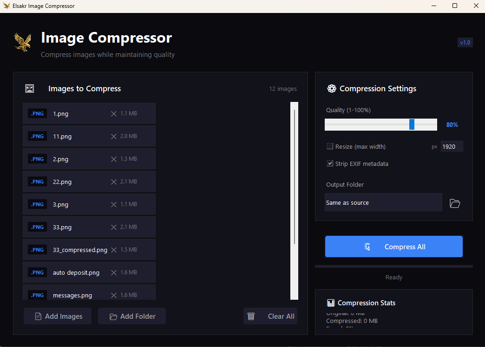

# 🦅 Elsakr Image Compressor (Desktop)

[](https://elsakr.company)
[](https://elsakr.company)
[](LICENSE)


## Overview
Part of the **Elsakr Open Source Tools Ecosystem** — global proactive solutions for developers, designers, and marketers.
> **[View All Tools](https://elsakr.company/tools)**

**Your images are too heavy. Your website is slow. Fix it.**
A powerful desktop application designed to drastically reduce image file sizes (JPG, PNG, WebP) without visible quality loss. Essential for SEO and page speed optimization.

## 🚀 Features
- 🔹 **Smart Compression**: Reduces size by up to 80% with maintained quality.
- 🔹 **Batch Processing**: Drag and drop hundreds of images at once.
- 🔹 **Format Support**: JPG, PNG, WebP.
- 🔹 **Privacy**: No cloud uploads, everything stays on your machine.

## 📸 Screenshots / Demo


## 📦 Getting Started

### 💻 Installation
Download the latest release or clone the repo:
```bash
git clone https://github.com/khalidsakrjoker/Elsakr-Image-Compressor.git
```

### ▶️ Usage
1. **Add Images**: Drag files into the window.
2. **Config**: Set desired format and quality (e.g., WebP 80%).
3. **Compress**: Start the process.
4. **Done**: Get your optimized images in a dedicated folder.

## 🤝 Contributing
Contributions are greatly appreciated.

## 📝 License
This project is licensed under the MIT License.

## ⭐ Signature
**Elsakr** — *Open Source Tools with a Falcon’s Vision.*  
[elsakr.company](https://elsakr.company)

---

# 🇪🇬 النسخة العربية (Arabic Version)

## 🦅 ضاغط الصور (Desktop Compressor)
قلل حجم صورك بنسبة بتوصل لـ 80% من غير ما تخسر الجودة. أداة أساسية عشان تسرع موقعك وتحسن الـ SEO. بتدعم ضغط صور كتير مرة واحدة.
